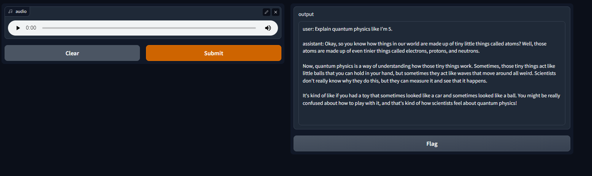

# Chatty

Chatty uses OpenAI's 
* Speech to Text - _Whisper engine_
* Chat Completion - _gpt-3.5-turbo_

functions to be a helpful guide.

Also, the ui is generated by `gradio` 

User can speak to their microphone and record their query, Chatty can understand 
and generate a response.



### How To

Create a `.env` file at the root. 

Then, you will need a [OpenAI API KEY](https://platform.openai.com/account/api-keys). Once you create one, simple put that API KEY into `.env`. Chatty will read that.

Create and activate your environment

`pip install -r requirement.txt`

#### To Run
```
cd chatty
python app/main.py
```